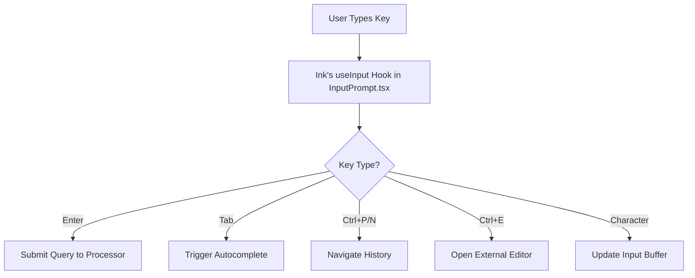

# Gemini CLI Input Processing: A Deep Dive (v2)

This document provides a comprehensive overview of how the Gemini CLI processes user input, from the initial keystroke to the final response from the Gemini model. It is based on a detailed analysis of the codebase to ensure accuracy and depth.

## Table ofContents

1.  [Overview](#overview)
2.  [Entry Point and Mode Detection](#entry-point-and-mode-detection)
3.  [Interactive Mode: The React UI](#interactive-mode-the-react-ui)
4.  [Command Processing](#command-processing)
5.  [Gemini API Interaction](#gemini-api-interaction)
6.  [Model Response Processing](#model-response-processing)
7.  [The Tool Execution Lifecycle](#the-tool-execution-lifecycle)
8.  [How the Model Decides to Use Tools](#how-the-model-decides-to-use-tools)
9.  [Code Modification Workflow: A Detailed Look](#code-modification-workflow-a-detailed-look)
10. [Model Knowledge: Inherent vs. Contextual](#model-knowledge-inherent-vs-contextual)

## Overview

The Gemini CLI operates in two primary modes:

-   **Interactive Mode (TTY)**: A sophisticated terminal UI built with [React](https://react.dev/) and [Ink](https://github.com/vadimdemedes/ink) for rich, stateful interactions.
-   **Non-Interactive Mode**: A simpler, direct `stdin` to `stdout` pipeline, designed for integration with shell scripts and other tools.

Beyond these modes, the CLI incorporates advanced features like a sandboxed execution environment, automatic memory management, and a robust tool-using agentic engine.

## Entry Point and Mode Detection

The CLI's journey begins at `packages/cli/index.ts`, which immediately calls the `main()` function in `packages/cli/src/gemini.tsx`. The first critical task is to determine the operational mode.

```typescript
// packages/cli/src/gemini.tsx

export async function main() {
  // ... initial configuration and settings load ...

  let input = config.getQuestion(); // Get question from command-line arguments

  // Check if we are in an interactive terminal and no initial question was provided.
  if (process.stdin.isTTY && input?.length === 0) {
    // Interactive mode: Render the full React UI
    render(<AppWrapper ... />);
    return;
  }

  // If not a TTY, we might be getting piped input.
  if (!process.stdin.isTTY) {
    input += await readStdin();
  }

  // Non-interactive mode: Process the input directly.
  await runNonInteractive(config, input);
  process.exit(0);
}
```

Before this primary mode selection, the CLI performs several startup tasks:
-   **Memory Management**: It checks if it needs to increase its own memory allocation (`--max-old-space-size`) and, if so, relaunches itself transparently.
-   **Sandboxing**: If enabled, it will re-execute itself within a secure sandbox environment using the `start_sandbox` utility.

## Interactive Mode: The React UI

The interactive mode is powered by a React application rendered directly into the terminal.

### UI Architecture

-   **`App.tsx`**: The root component that orchestrates the entire UI.
-   **`InputPrompt.tsx`**: The core component for handling user input. It's more than a simple text box, providing:
    -   Multi-line editing capabilities.
    -   Command history navigation (Ctrl+P/N, Arrow Keys).
    -   Autocomplete suggestions (Tab).
    -   Integration with external editors like VS Code or Vim for complex inputs (Ctrl+E/X).
-   **State Management**: React's context API (`SessionContext.tsx`, `StreamingContext.tsx`) is used to manage global state like conversation history, tool calls, and streaming responses.

### Input Capture Flow



## Command Processing

User input is parsed and routed to different processors based on special prefixes. This logic resides in custom React hooks within `packages/cli/src/ui/hooks/`.

### 1. Slash Commands (`/`) - `slashCommandProcessor.ts`

These are client-side commands that manage the UI or CLI state. They do not involve the Gemini model.

-   `/help`: Shows the help dialog.
-   `/docs`: Opens the full documentation in a browser.
-   `/clear`: Clears the screen and resets the conversation history.
-   `/theme`: Opens the theme selection dialog.
-   `/auth`: Changes the authentication method.
-   `/editor`: Sets the preferred external editor.
-   `/memory`: Manages the model's contextual memory (`show`, `add`, `search`, `clear`).
-   `/mcp`: Manages connections to other MCP servers (`status`, `discover`).
-   `/stats`: Shows detailed session statistics.
-   `/savechat`, `/loadchat`: Saves and loads conversation history.
-   `/yolo`: Toggles auto-approval for all tool calls.
-   `/quit`: Exits the CLI.

### 2. At Commands (`@`) - `atCommandProcessor.ts`

These commands are a shortcut for reading files and directories into the context.

-   `@filename`: Reads a single file.
-   `@directory/`: Reads all files in a directory recursively. This is converted to a glob pattern (`@directory/**`).
-   **Glob Support**: Full glob patterns are supported (e.g., `@src/**/*.ts`).
-   **Smart Resolution**: If a path like `@my-component.tsx` isn't found, the processor performs a recursive search to find the best match.
-   **Underlying Tool**: This command is syntactic sugar over the `read_many_files` tool. It processes the paths and then schedules a call to this tool.

### 3. Shell Mode (`!`) - `shellCommandProcessor.ts`

A powerful feature that allows executing shell commands directly within the CLI.

-   **Activation**: Triggered by typing `!` in an empty prompt.
-   **Execution**: Commands are executed using `child_process.spawn` within the project's root directory.
-   **`cd` Tracking**: On Linux and macOS, it uses a clever trick to track the current working directory. The command is wrapped (`{ <user_command> }; pwd > /tmp/shell_pwd.tmp`) to capture the final directory after the command completes, allowing `cd` to work as expected across commands.
-   **Binary Output Detection**: It inspects the initial bytes of the output stream. If binary content is detected, it stops streaming to the UI to avoid garbling the terminal and shows a summary instead (e.g., `[Receiving binary output... 1.2MB received]`).
-   **Contextual Awareness**: The `stdout`, `stderr`, and `exitCode` of the command are formatted and sent back to the Gemini model, so it is aware of the outcome.

### 4. Regular Queries

Any input that doesn't match the prefixes above is treated as a standard prompt and sent to the Gemini API via the `useGeminiStream` hook.

## Gemini API Interaction

The core interaction with the Gemini API happens in `packages/core`.

-   **Client**: `GeminiClient` in `packages/core/src/core/client.ts` is the low-level client for making API requests.
-   **Content Generation**: `ContentGenerator` in `packages/core/src/core/contentGenerator.ts` orchestrates the `generateContentStream` calls.

### Complete Request Structure

A request to Gemini is more than just the user's text. It includes:
1.  **System Instruction**: A detailed prompt defining the model's persona, capabilities, and rules. Generated by `getCoreSystemPrompt()`.
2.  **Tool Declarations**: The full JSON schemas of all available tools (from `tool-registry.ts`).
3.  **Chat History**: The complete history of the conversation, including previous user prompts, model responses, and the results of tool calls.
4.  **User Message**: The user's current query, wrapped in a `Content` object.

```typescript
// A simplified view of the generateContentStream call
contentGenerator.generateContentStream({
  model: 'gemini-2.5-pro',
  contents: [...chatHistory, userContent],
  config: {
    systemInstruction: getCoreSystemPrompt(userMemory),
    tools: [{ functionDeclarations: [...] }],
    // ... other config like temperature, topP, etc.
  }
});
```

## Model Response Processing

The `useGeminiStream` hook processes the streaming response from the model, which can contain several event types.

1.  **Thought Events**: The model's reasoning process, explaining its plan.
2.  **Content Events**: The model's textual response to the user.
3.  **Tool Call Requests**: A request from the model to execute one or more tools.

This flow is managed by the `CoreToolScheduler`.

## The Tool Execution Lifecycle

When the model requests a tool call, the `CoreToolScheduler` (`packages/core/src/core/coreToolScheduler.ts`) takes over. It manages the entire lifecycle of a tool call through a state machine.

### Tool Call States

A tool call progresses through these states:
`scheduled` → `validating` → `awaiting_approval` → `executing` → `success` / `error` / `cancelled`

### The Approval Flow

-   **`awaiting_approval`**: This is a critical state. If a tool requires confirmation (like `edit_file`), the scheduler pauses and enters this state.
-   **Confirmation UI**: The UI layer listens for this state and displays a confirmation prompt to the user (e.g., the `diff` view for a file edit).
-   **User Decision**: The user can `approve`, `cancel`, or even `modify` the tool call.
-   **`YOLO` Mode**: The `/yolo` command puts the scheduler in a mode where all confirmations are automatically approved, enabling fully autonomous operation.

### `ModifiableTool` Interface

Some tools, like `edit_file`, implement the `ModifiableTool` interface. This allows the user to edit the parameters of the tool call *before* it executes. The `shouldConfirmExecute` method on the tool is responsible for generating the confirmation details (like a `diff`) that the user sees.

### Response Handling

Once a tool finishes, the `CoreToolScheduler` formats its output into a `functionResponse` part, which is a structured object the Gemini API understands. This response is then added to the chat history and sent back to the model in the next turn, closing the loop.

## How the Model Decides to Use Tools

The model's ability to use tools is not magic; it's a result of careful prompting and API design.

1.  **System Prompt**: The system prompt contains explicit instructions on how and when to use tools, with examples.
2.  **Function Declarations**: The detailed JSON schema for each tool, including descriptions of the tool and its parameters, is the primary information the model uses to select the right tool for a job.
3.  **Few-Shot Examples (Implicit)**: The conversation history, containing previous successful tool calls and their results, serves as a dynamic set of examples that guide the model's future decisions.

## Code Modification Workflow: A Detailed Look

The most complex agentic workflow is modifying code. This is a multi-step process that showcases the full power of the CLI's agentic engine.

### Overall Strategy

1.  **Discovery**: Find relevant files using `grep` and `ls -R`.
2.  **Comprehension**: Read the files with `read_file` or `read_many_files` to build context.
3.  **Planning**: Formulate a step-by-step plan (visible in the "thought" process).
4.  **Execution**: Carry out the plan using the `edit_file` tool.

```mermaid
graph TD
    A[User Request: "Add a new field to the User profile"] --> B(Phase 1: Discovery);
    B --> C[Model calls `grep` for "UserProfile"]
    C --> D[Model calls `read_file` on candidate files]
    D --> E(Phase 2: Planning);
    E --> F["**Thought**: I need to edit types.ts and UserProfile.tsx..."];
    F --> G(Phase 3: Execution);
    G --> H[Model calls `edit_file` for `types.ts`];
    H --> I{Scheduler pauses for approval};
    I --> J[User sees `diff` and approves];
    J --> K[Edit is applied];
    K --> L[Model calls `edit_file` for `UserProfile.tsx`];
    L --> M[...cycle repeats...];
    M --> N[All edits complete];
    N --> O[Final Response to User];
```

### The `edit_file` Tool in Depth (`packages/core/src/tools/edit.ts`)

The `edit_file` tool (internally named `replace`) is highly sophisticated.

-   **Precision Targeting**: The model is prompted to provide a large, verbatim block of text for the `old_string` parameter, including several lines of context. This acts as a unique anchor.
-   **Safety Checks**: The tool first validates that the `old_string` appears the `expected_replacements` number of times (usually 1). If not, it fails with a descriptive error, forcing the model to refine its `old_string` and try again. This is the core of the **refinement loop**.
-   **Self-Correction with `ensureCorrectEdit`**: If the `old_string` is *almost* correct but has minor whitespace or comment differences, the tool makes a call *back to the LLM* to try and fix the inaccuracies. This self-correction makes the process remarkably resilient.
-   **User Confirmation**: As a `ModifiableTool`, it generates a `diff` and waits for user approval before writing anything to disk.

## Model Knowledge: Inherent vs. Contextual

It's crucial to distinguish between the model's two types of knowledge.

### 1. Inherent (Pre-trained) Knowledge
This is the model's vast, static knowledge from its training data.
- **Programming Languages**: Syntax, standard libraries, idioms.
- **Shell Commands**: How `ls`, `grep`, `find`, etc., work.
- **Software Concepts**: Git, software architecture, etc.

### 2. Contextual (Session) Knowledge
The model starts every session with **zero knowledge** of your project. It acquires this knowledge dynamically using its tools.
1. **Discovery**: Uses `ls` and `grep` to learn the file structure and find relevant code.
2. **Comprehension**: Uses `read_file` to load file contents into its context window.
3. **Context Building**: The output of every tool call is added to the conversation history, which forms the model's short-term memory for the current task.

All reasoning and code generation is a synthesis of this inherent knowledge and the specific contextual knowledge gathered during the session. 